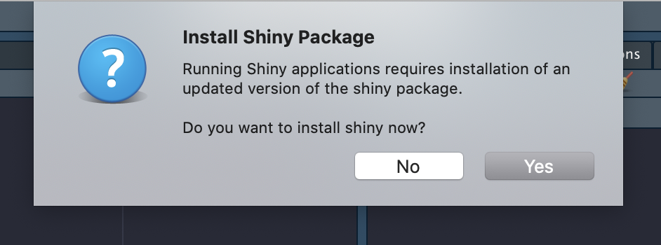
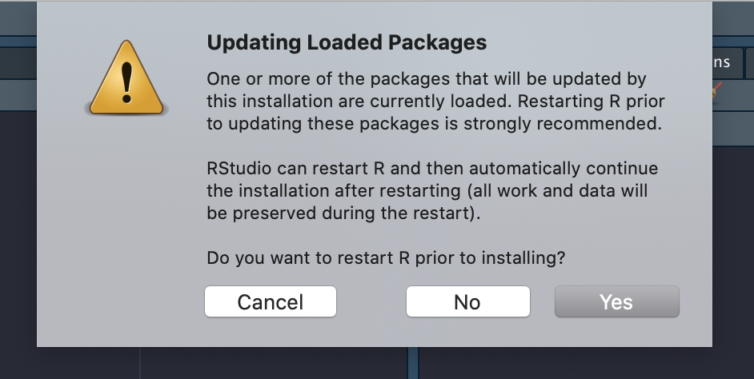
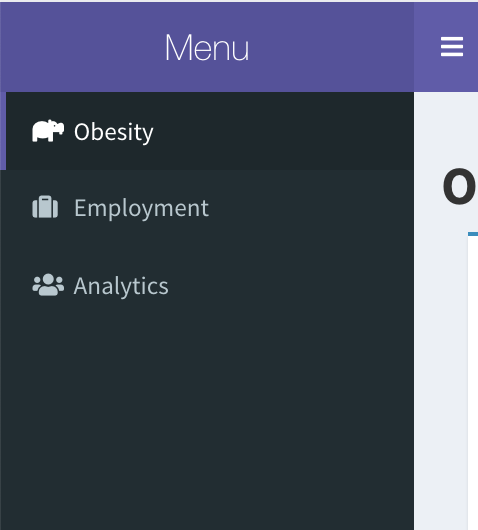
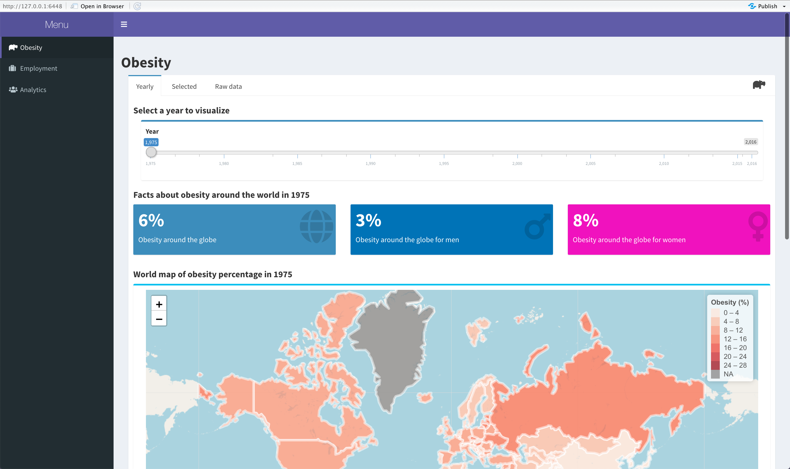
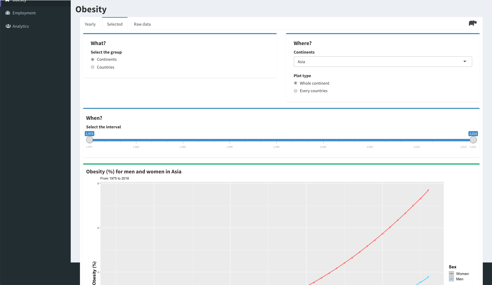
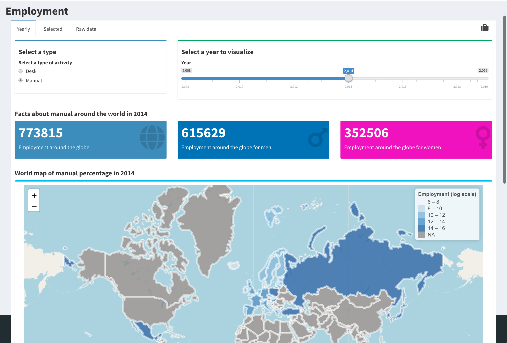
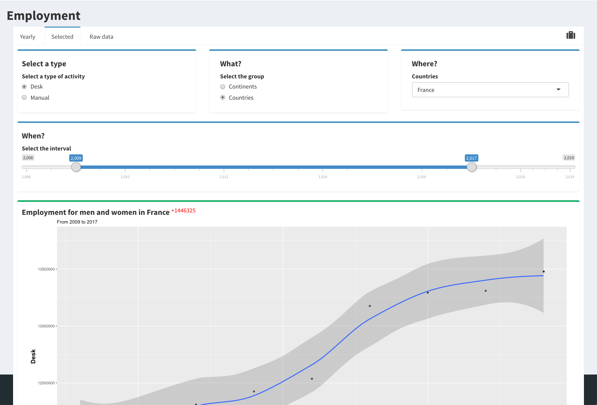
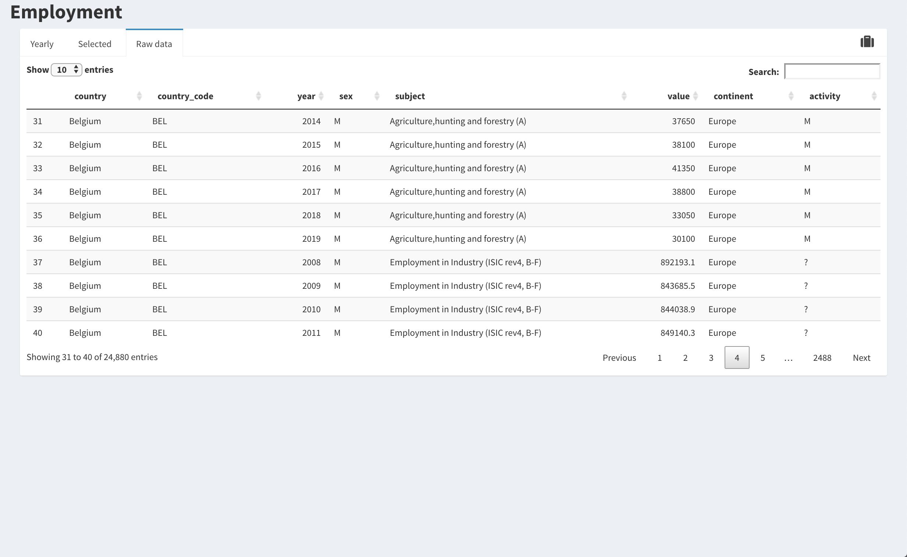
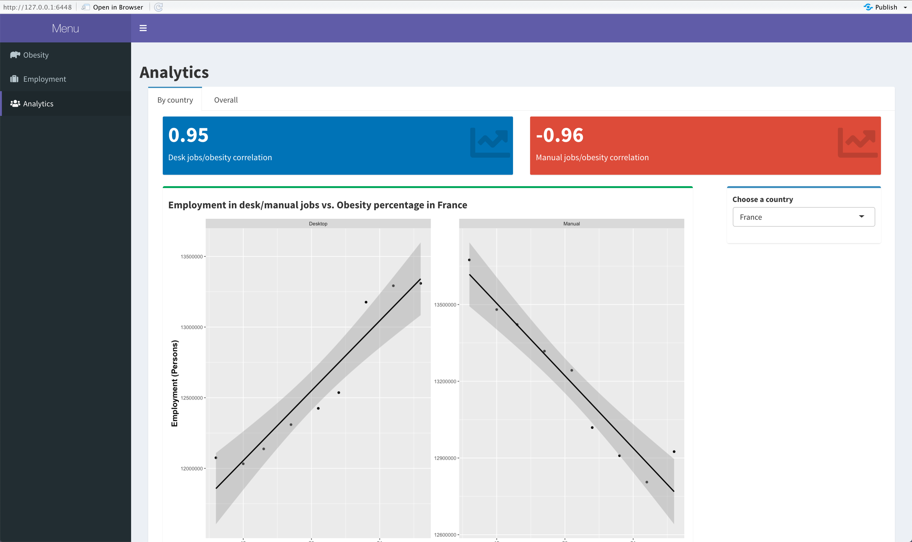
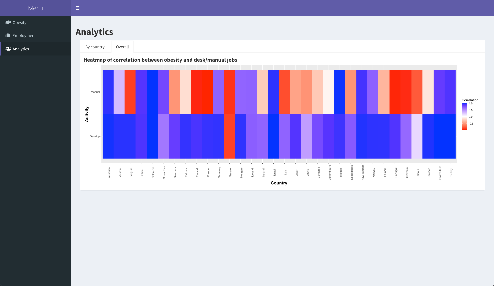

⚠️ **<ins style="color:red"><span style="color:red">Important:</span></ins>**
Avant tout, si le nom du document n'est pas README.html alors il est conseillé de lire le README.html car celui-ci permet d'afficher les couleurs dans le rapport d'analyse contrairement au <span>README.md</span>.

# Introduction


> sources: [R](https://static.wixstatic.com/media/9bd675_3f6d56eaa67d4ae2b8b159e21693fca9~mv2.png/v1/fill/w_864,h_606,al_c,q_90,usm_0.66_1.00_0.01/9bd675_3f6d56eaa67d4ae2b8b159e21693fca9~mv2.webp), [ESIEE Paris](https://upload.wikimedia.org/wikipedia/fr/7/71/Logo_ESIEE_Paris.svg)
  
Dans le cadre du module "*R & Data Visualization*" (**DSIA-4101C**), nous avons eu l'opportunité de créer un dashboard liant les compétences acquises grâce ce module avec notre créativité. Le projet se réalisa en binôme et l'objectif fut de fournir une représentation intéractive (dashboard) d'un jeu de données accessibles publiquement et non modifiées.  

Notre responsable:
- **COURIVAUD Daniel**

Notre binôme est composé de:
- **RAFIDINARIVO Itokiana**
- **FONTA Romain**
  
Et nos jeux de données sont:
- *[Obesity among adults by country, 1975-2016](https://www.kaggle.com/amanarora/obesity-among-adults-by-country-19752016)*
  > *source: Kaggle*
- *[Employment by activities (ISIC Rev.4)](https://stats.oecd.org/Index.aspx?QueryId=3491)*
  > *source: OECD Stats*

#### Problématique
Alors notre binôme s'est demandé: <ins>*Existe t'il un lien entre l'obesité et les emplois bureautiques <sup>et</sup>/<sub>ou</sub> manuels?*</ins>

<br>

___

# Table des matières

[[_TOC_]]
___


# I. Guide utilisateur

## 1. Installation & Téléchargement

### A. Langage *R*

Dans un premier temps, afin d'utiliser notre projet il faudra posséder **R version 4.0.2** de préférence sur votre appareil. Pour cela, que votre appareil soit sous Linux, macOS, Windows ou autre, rendez vous la page de téléchargement de R en cliquant [ici](https://cran.r-project.org/mirrors.html). Puis suivez les instructions lors de l'installation.

### B. RStudio

Dans un second temps, installer R ne suffit pas. Le projet est plus accessible à l'utilisation si RStudio est installé sur votre appareil. Voici le lien pour le télécharger [ici](https://rstudio.com/products/rstudio/download/).

### C. Le dashboard

#### Télécharger le projet

Le projet est téléchargeable sur le la page suivante [ici](https://git.esiee.fr/rafidini/projet_r). Celui-ci pourra être utilisé comme un "Git Repository", en "*forkant*" le projet, ou comme un projet dossier normal, en "*clonant*" le projet sur votre ordinateur.

## 2. Installation des packages nécessaires et exécution

Pour que le projet marche comme il faut, des packages supplémentaires sont nécessaires. Le nom de ces packages est disponible dans le fichier *packages.csv*:

```shell
...
"rnaturalearth"
"sp"
"leaflet"
"DT"
"tidyverse"
...
```

Ceux-ci seront utilisés dans le début du script *global.R*. Afin d'installer ces packages et exécuter le projet il faudra suivre ce protocole:

**1) Ouvrir le projet avec RStudio**

Pour ouvrir le projet avec RStudio, il faut aller dans le menu puis faire une des propositions suivantes:
- cliquer sur *File/New Project/Existing Directory* puis indiquer le chemin vers le projet
- cliquer sur *File/Open Project* puis indiquer le chemin vers le projet

Normalement après vous aurez ceci:


**2) Appuyer sur *RunApp***

Après avoir eu approximativement la même page qu'au dessus (surtout il faudra ouvrir le fichier *app.R* grâce à la fenêtre en bas à droite pour avoir les mêmes boutons), appuyer sur le bouton *Run App*.

Lors de l'exécution des fenêtres apparaîtront, voici ce qu'il faudra faire avec elles:

- <ins>***Install Shiny Package***:</ins> Cliquez sur **Yes**


- <ins>***Updating Loaded Packages***:</ins> Cliquez sur **No**


Si tout se passe bien, alors le projet est utilisable.

## 3. Utilisation

Une fois éxécuté, le "*dashboard*" apparaît sous la forme d'un navigateur web généré par RStudio.

### A. Bar de navigation

Pour d'accéder aux différentes pages proposées par l'application il y a la bar de navigation latéral (ci-dessous). L'application propose 3 pages:
- *Obesity*
- *Employment*
- *Analytics*



Tous sont accessibles en cliquant sur le label correspondant à la page de la bar de navigation.

### B. Page *Obesity*

Sur cette page, *Obesity*,  on utilise le jeu de données *Obesity among adults by country, 1975-2016*. Celle-ci est divisée en plusieurs sous-pages:

- #### *Yearly*



Sur cette sous-page, on peut visualiser différents faits annuels sur l'obésité dans le monde. Il y a une carte qui permet de visualiser répartition du pourcentage de l'obésité dans le monde et la distribution par sexe de l'obesité (histogramme en bas de la page).

- #### *Selected*



Sur cette sous-page, on peut visualiser l'évolution de l'obésité au sein d'un pays/continent dans un interval donnée.

- #### *Raw data*


Sur cette sous-page, on peut avoir accès aux données brutes sous la forme d'un tableau.

### C. Page *Employment*

Sur cette page, *Employment*,  on utilise le jeu de données *Employment by activities (ISIC Rev.4)*. Celle-ci est divisée en plusieurs sous-pages comme *Obesity*:

- #### *Yearly*
  


Sur cette sous-page, on peut visualiser différents faits annuels sur l'emploi selon le type d'activité indiqué dans le monde. Il y a une carte qui permet de visualiser répartition de l'emploi dans le monde et la distribution par sexe de l'emploi (histogramme en bas de la page).

- **<ins>Remarques:</ins>** Toute la carte ne sera pas colorée car les données ne prennent en compte seulement les pays membre de l'OECD qui ne comptent que 37 pays membres.

- #### *Selected*



Sur cette sous-page, on peut visualiser l'évolution de l'emploi au sein d'un pays/continent dans un interval donnée selon un type d'activité.

- #### *Raw data*



Sur cette sous-page, on peut avoir accès aux données brutes sous la forme d'un tableau.

### D. Page *Analytics*

Sur cette page, *Analytics*, on utilise les deux jeux de données utilisés pour les pages *Obesity* et *Employment*. Celle-ci est aussi divisée en plusieurs sous-pages:

- #### *By country*



Sur cette sous-page, on peut visualiser la correlation entre l'obésité et les emplois bureautiques/manuels pour un pays. On a un graphique avec une courbe qui a pour abscisse le pourcentage d'obésité et en ordonnée le nombre d'employés dans une activité et on a aussi le coefficient de correlation afficher au dessus. Si la correlation est négative alors l'élément devient rouge sinon si elle est positive, bleue.

- #### *Overall*



Sur cette sous-page, on peut visualiser la correlation entre l'obésité et les emplois bureautiques/manuels pour tout les pays sous forme de "*carte de chaleur*" (*heatmap*) où la couleur représente la correlation (rouge=négative, bleu=positive), l'abscisse les pays et l'ordonnée le type d'activité.

# II. Guide développeur

## 1. Les répertoires & fichiers

### A. *README.md*

Ce fichier *Markdown*, que vous êtes actuellement en train de lire normalement, contient:
- Présentation du projet
- Guide utilisateur
- Guide développeur
- Rapport d'analyse

### B. *data*

Ce répertoire contient l'ensemble des jeux de données utilisés pour le projet. Voici leurs utilités:

- **employment.csv**: Le jeu de données sur l'emploi, *Employment by activities (ISIC Rev.4)*.

- **obesity.csv**: Le jeu de données sur l'obésité, *Obesity among adults by country, 1975-2016*.

### C. *images*

Ce répertoire contient l'ensemble des images pour le projet, mais ces images servent principalement pour la rédaction de ce guide.

### D. *packages.csv*

Ce fichier texte contient les noms des différents packages nécessaires à l'utilisation du projet.

### E. *process.R*

Ce script *R* sert au traitement des données.

### F. *app.R*

Ce script *R* continent le code pour lancer l'application.

### G. *global.R*

Ce script *R* exécute le traitement des données, contient les fonctions à utiliser pour générer les graphiques/textes/valeurs necessaires à l'application.

### H. *ui.R* & *server.R*

Ces scripts *R* s'occupent de l'interface utilisateur (*ui.R*) et du serveur (*server.R*). En soit *ui.R* permet de créer la page de manière visuelle mais l'interactivité avec les données se fait grâce à *server.R*.

## 2. Le code

### A. process.R

Ce script est structuré de la manière suivante:

```R

# This script contains the processing code.
#

#- Libraries -#
...

#- Functions -#
...

#-- Processing functions --#
processObesity <- function(pObesityPath){...}

processEmployment <- function(pEmploymentPath){...}
...
```

- *Libraries*: contient l'importations des packages necessaires à ce script.
- *Functions*: contient les fonctions qui permettent de faire de petites opérations (*ex: Récupérer le nom du continent à partir d'un pays, extraire les réels dans une chaîne de caractères.*).
- *Processing functions*: contient les fonctions qui vont traiter individuellement un jeu de données.

- #### Traitement de *obesity* dans *"processObesity"*:

- Renommage de certaines variables:
  
| Anciens noms | Nouveaux noms |
|---|---|
| Obesity | str_obesity |
| Country | country |
| Year | year |
| Sex | sex |

- Création de la variable *continent*:

On utilise alors la fonction ***countrycode*** du package *countrycode* pour créer la variable continent. Afin de gérer quelques exceptions, la fonction ***convertCountryNameToContinent*** a été créée.

- Extraction de réels à partir d'une chaîne de caractères:

La fonction *extractFloatFromString(str, index)* permet d'extraire un réel dans une chaîne de caractère à un indice donné. On extrait les réels dans la variable str_obesity anciennement Obesity (%) en sachant que les valeurs de cette variable sont des chaînes de caractères dans le format suivant:

```Math
S_i="X_{i,0}[X_{i,1}-X_{i,2}]", S_i \in \text{obesity}, X_{i,j} \in \mathbb{R}
```

Donc:

```Math
extractFloatFromString(S_i, 0)=X_{i,0} \\
extractFloatFromString(S_i, 1)=X_{i,1} \\
extractFloatFromString(S_i, 2)=X_{i,2} \\
```

- Création de la variable *country_code*:

On utilise aussi alors la fonction ***countrycode*** du package *countrycode* pour créer la variable continent.

- Changement des valeurs pour la variable sex

| Anciennes valeurs | Nouvelles valeurs |
|---|---|
| Both sexes | B |
| Male | M |
| Female | F |

- #### Traitement de *employment* dans *"processEmployment"*:

- Renommage de certaines variables:
  
| Anciens noms | Nouveaux noms |
|---|---|
|Country | country | 
|LOCATION |country_code | 
|Time | year |
|Sex |sex |
|Subject | subject |
|Value | value |

- Changement des valeurs pour la variable value

Étant donnée que les valeurs de la variable value sont des nombres qui représentent des milliers, on multiple les valeurs de cette colonne par 1 000.

- Création de la variable *continent*:

Comme pour obesity, on va créer la variable continent à partir de ***countrycode*** et la fonction *convertCountryNameToContinent* qui a été créée à l'occasion

- Changement des valeurs pour la variable sex

| Anciennes valeurs | Nouvelles valeurs |
|---|---|
| All persons | B |
| Males | M |
| Females | F |

- Création de la variable *activity*:
  
Celle-ci a été créée de manière subjective à notre binôme, les détails sont présents dans la fonction ***convertSubjectToActivity***.

### B. global.R

```R
#
# This script contains objects that will be used through every R script
# in the project.
#

#- Necessary packages -#
...

#- Load packages -#
...

#- Data processing -#
...

#- Functions -#
...
```
- *Necessary packages*: contient le code qui va installer les packages nécessaires au projet.
- *Load packages*: importation des packages.
- *Data processing*: appel des fonctions de traitement de données présents dans *process.R*.
- *Functions*: contient les différentes fonctions pour générer des graphiques/dataframe/valeurs que l'on utilisera dans *server.R*.

### C. ui.R

```R
#
# This script contains the user interface code.
#

body <- dashboardBody(...)

header <- dashboardHeader(
  title = "Menu"
)

sidebar = dashboardSidebar(...)

ui <- dashboardPage(
  
  # Theme of the app
  skin = "purple",
  
  # Skeleton
  header,
  sidebar,
  body
)
```
Voici le rôle de chacunes de ces variables: 
- *body*: Cette variable contient le corps de l'application grâce à la fonction *dashboardBody*.
- *header*: Cette variable contient l'entête de la page grâce à la fonction *dashboarHeader*, il contient seulement le titre dans notre cas.
- *sidebar*: Cette variable contient la bar de navigation latéral de l'application grâce à la fonction *dashboarSidebar*, il contient des items qui permettent de changer de page.
- *ui*: Cette variable contient l'ensemble de l'interface grâce à la fonction *dashboarPage* qui prend en paramètre *nody*, *sidebar* et *ui*.

### D. server.R

```R
#
# This script contains the code for the server.
#

# Define server logic required to build interactive user interface
server <- function(input, output) {
  # Obesity : Yearly
  ...

  # Obesity : Selected
  ...

  # Obesity : Selected
  ...

  # Employment
  ...

  # Analytics : By country
  ...

  # Analytics : Overall
  ...
}
````

LA majorité du script est contenu dans la défition de la fonction *server*. Celui-ci est divisé par page <ins>et</ins> sous-page. Comme ci-dessus on parcours la partie *Obesity*, *Employment* puis *Analytics*. Dans chaque partie il y a des choses comme ceci:

```R
output$map <- renderLeaflet({ obesityMapByYear(input$year) })
````

Ici on associe au composant du projet ayant comme identifiant *map* la carte qui est générée avec la fonction renderLeaflet et créée *obesityMapByYear* avec le paramètre *input$year* qui est généré par le composant, pouvant prendre une valeur en entrée, de l'interface utilisateur ayant l'identifiant *year*.

### E. app.R

```R
#
# This script is for the application.
#

# Load the ui and server part of the app
source("ui.R")
source("server.R")


# Run the application
shinyApp(ui = ui, server = server)
```

Ce petit script, mais très important, est divisé en deux parties.
- L'importation de l'interface utilisateur et du serveur qui sont dans les scripts *ui.R* et *server.R*.
- L'appel de la fonction *shinyApp* avec pour paramètre *ui* et *server* définis dans les scripts vus précédemment.

# III. Rapport d'analyse

## 1. Les données

A partir d'ici on suppose que les données on déjà été traitées, pour plus de détails [ici](#c-script-process_datapy).

### A. Obesity among adults by country, 1975-2016

Ce jeu de données provient de *[Kaggle](https://www.kaggle.com/amanarora/obesity-among-adults-by-country-19752016)*, une communauté regroupant des outils et des ressources pour la data science, précisément celui-ci a été modifié par l'utilisateur *[Aman Arora](https://www.kaggle.com/amanarora)* à partir des données originales se trouvant [ici](https://apps.who.int/gho/data/node.main.A900A?lang=en) sur le site l'*Organisation Mondiale de la Santé (OMS)*.
  
Dans ce jeu de données on retrouve le pourcentage de personnes obèses, pour les hommes/femmes/les deux, au sein d'un pays pour une année spécifique. Celui-ci est composé de **24 570 enregistrements/lignes** et de **8 variables**.

  
Voici la structure du jeu de données post-traitement:

<br>

| Variables | Type | Description |
|:-----------:|:-----------:|:-----------|
| **country** | Categoriel (nominal) | *Le pays* |
| **country_code** | Categoriel (nominal) | *Le code du pays en format ISO3* |
| **continent** | Categoriel (nominal) | *Le continent, associé au **country*** |
| **year** | Numérique (ratio) | *L'année* |
| **sex** | Categoriel binaire (nominal) | *Le sexe, on ne prend en compte que l'homme ou la femme* |
| **obesity** | Numérique (ratio) | *L'obesité moyenne en pourcentage pour un pays et un sexe donné* |
| **max_obesity** | Numérique (ratio) | *La valeure minimale en pourcentage de l'obesité* |
| **min_obesity** | Numérique (ratio) | *La valeure maximale en pourcentage de l'obesité* |

<ins>Remarques :</ins>
- On ne travaille pas avec les variables **max_obesity** et  **min_obesity**, ceux-ci ont été gardées au cas où elles deviendraient utiles à autrui ultérieurement.
- La variable **country_code** sert pour le graphique géolocalisé, on utilise un jeu de données complémentaire afin d'obtenir les coordonnées géographiques de chaque pays.

<br>

### B. Employment by activities (ISIC Rev.4)

Ce jeu de données provient de *[OECD (Organisation for Economic Co-operation and Development)](https://stats.oecd.org/Index.aspx?QueryId=3491)*, une organisation économique intergouvernementale composée de 37 pays fondée en 1961 (*Wikipedia*) dans le but de stimuler la progression économique et les échanges.
  
Dans ce jeu de données on retrouve le nombre d'employés selon des activités économiques. Ces activités économiques sont définies par l'*International Standard Industrial Classification (ISIC) Revision 4*, on y retrouve les activités suivantes:

1. Agriculture, forestry and fishing
1. Mining and quarrying
2. Manufacturing
3. Electricity, gas, steam and air conditioning supply
4. Water supply; sewerage, waste management and remediation activities
5. Construction
6. Wholesale and retail trade; repair of motor vehicles and motorcycles
7. Transportation and storage
8. Accommodation and food service activities
9. Information and communication
10. Financial and insurance activities
11. Real estate activities
12. Professional, scientific and technical activities
13. Administrative and support service activities
14. Public administration and defence; compulsory social security
15. Education
16. Human health and social work activities
17. Arts, entertainment and recreation
18. Other service activities
19. Activities of households as employers; undifferentiated goods- and services-producing activities of households for own use
20. Activities of extraterritorial organizations and bodies

Voici la structure du jeu de données post-traitement:

<br>

| Variables | Type | Description |
|:-----------:|:-----------:|:-----------|
| **country** | Categoriel (nominal) | *Le pays* |
| **country_code** | Categoriel (nominal) | *Le code du pays en format ISO3* |
| **continent** | Categoriel (nominal) | *Le continent, associé au pays* |
| **sex** | Categoriel binaire (nominal) | *Le sexe, on ne prend en compte que l'homme ou la femme* |
| **year** | Numérique (ratio) | *L'année* |
| **subject** | Categoriel (nominal) | *L'activité économique (listées au-dessus)* |
| **activity** | Categoriel binaire (nominal) | *Le type d'emploi, soit bureautique, soit manuel* |
| **value** | Numérique (ratio) | *Le nombre d'employés dans le secteur, associé à un secteur/année/pays* |

<ins>Remarques :</ins>
- La création de la variable **activity** a été faite manuellement à partir de la variable **subject** donc celle-ci reste subjective à notre binôme.

<br>


## 2. Observations

Maintenant analysons les jeux de données sur l'obésité et l'emploi afin de répondre à notre problématique.

### A. Obesity among adults by country, 197=5-2016 

- #### Cartographie & Distribution

| 1975 | 1996 | 2016 |
|:-----------:|:-----------:|:-----------:|
|||
||| 

- On observe plusieurs choses avec ces cartes et histogrammes:
  - Les **pays les moins développés** sont ceux qui possèdent une **croissance faible même quasi nulle du pourcentage d'obesité**.  
  - Les **pays les plus développées/riches** et les **pays en voie de développement** possèdent une croissance un peu plus élevée du pourcentage d'obésité.
  - Un pays a réussi à avoir une majorité de sa population en obésité (*Nauru*).

- #### Analyse spacio-temporelle

<ins>Selon les continents:</ins>
  


- On observe plusieurs choses avec ce graphique:
  - **Dans chaque continent** le pourcentage d'obesité au sein de la population ne fait **que augmenter**.
  - Le continent avec me pourcentage d'obésité le plus élevé est l'**Amérique du nord**.
  - Le continent avec le pourcentage d'obésité le plus faible est l'**Asie**.

- <ins>Critiques:</ins>
  - Le calcul du pourcentage d'obésité par continent s'est fait par le calcul des moyennes d'obésité de chaque pays du continent sans prendre en compte le coefficient de population par pays, donc les résultats ne sont pas à 100% représentatifs de la réalité. 

<ins>Selon les continents et le sexe:</ins>

| Continent | Graphique |
|:---:|:---:|
| Asie |  |
| Europe |  |
| Amerique du nord |  |
| Amerique du sud |  |
| Océanie |  |

- On observe plusieurs choses avec ce graphique:
  - Dans tout les continents, peut importe le sexe, **la tendance pour le pourcentage de l'obésité est d'augmenter**.
  - Dans la majorité des continents **le pourcentage de femmes obèses est toujours plus élevé que les hommes**.
  - **L'Europe et l'Amérique du nord sont les continents qui auront tendance à inverser la position des courbes des hommes et des femmes**. Donc il est très probable qu'à partir d'une certaine année le pourcentage d'hommes obèses deviendra plus élevé que celui des femmes obèses.

- <ins>Critiques:</ins>
  - On retouve ici le même problème que le graphique précédent puisqu'on n'utilise pas le coefficient de la population pour le calcul de la moyenne d'obésité.

- #### Bilan

A partir de toutes ces observations on peut conclure que l'obésité est une maladie qui touche le monde entier cependant certains sont plus touchés que d'autres, notamment les pays riches et  les plus développés à quelques exceptions près. En plus de cela, les femmes sont plus touchées que les hommes par cette maladie en général cependant on observe une future transition de cette tendance en Europe et en Amérique du nord. Malheureusement **l'obésité peut être décrite comme une fonction croissante par rapport au temps**, c'est-à-dire que le pourcentage de personnes obèses ne fait qu'augmenter.

### B. Employment by activities (ISIC Rev.4)

- #### Analyse spacio-temporelle

<ins>Selon le type d'activité:</ins>


- On observe plusieurs choses avec ce graphique:
  - Le nombre d'employés dans **les deux types d'activité augmente jusque 2018** puis **en 2019 on a une petite chute** (peut-être dû à la crise de la *COVID-19*).
  - Il y a **plus d'employés dans les activités manuelles que dans les activités bureautiques**.

<br>

<ins>Selon le type d'activité pour un échantillon de pays:</ins>


- On observe plusieurs choses avec ce graphique:
  - La majorité des pays possède **plus d'employés dans le manuel que dans le bureautique**.
  - Certains pays ont subi une **transition où le nombre d'employés en bureautique est plus élévé que dans le manuel**. On remarque aussi le fait que **le bureautique augmente** et le **manuel diminue ou se stabilise** après cette transition.

<ins>Répartion des activités manuelles:</ins>


- On observe plusieurs choses avec ce graphique:
  - ***Le commerce de gros et de détail, la réparation de véhicules automobiles et de motos*** représente environ un quart (*25%*) des activités manuelles.
  - ***La production*** représente aussi environ un quart (*25%*) des activités manuelles.

<ins>Répartion des activités bureautiques:</ins>
 

- On observe plusieurs choses avec ce graphique:
  - ***Les activités sociales et médicales*** représente environ un quart (*25%*) des activités bureautiques. 
  - ***L'éducation*** représente environ un cinquième (*20%*) des activités bureautiques. 
  - ***L'administration et la défense publique*** représente environ *16%* des activités bureautiques. 

- #### Bilan

A partir de toutes ces observations on peut conclure qu'entre 2008 et 2018, l'emploi possédait une bonne dynamique car le nombre d'employés ne faisait qu'augmenter dans cet interval. Cependant à partir de 2019 il y a un arrêt de cette dynamique que l'on suppose être la crise sanitaire de la *COVID-19*. Puis les métiers bureautiques commencent peu à peu à devancer les métiers manuels dans certains pays européens.

### C. Comparaison des jeux de données

Nos deux jeux de données nous ont appris beaucoup de choses, cependant il serait intéressant de conclure sur notre problématique en faisant des opérations entre  elles.

- #### Contraintes

Malgré le fait que nos jeux de données soient chacunes assez complètes, elles ne proviennent pas de la même sources. Donc la fusion des jeux de données limites les comparaisons sur **15 164 enregistrement/lignes** dont **32 pays** répartis sur **les années [2008;2016]**.

- #### Correlation


- <ins>Explication du graphique:</ins>
  - En abscisse, les pays
  - En ordonnée, le type d'activité (*Desk: Bureautique, Manual: Manuel*)
  - Les carrés représentent la correlation entre l'obésité et le nombre d'employés dans le type d'activité. La couleur des carrés est interprété de la manière suivante:
    - Plus la couleur du carré se rapproche du **<span style="color:blue">bleu</span>** 🔵, donc de la valeur **<span style="color:blue">1</span>**, alors correlation est positive. Cela signifie que **<span style="color:blue">l'obésité et le type d'activité peuvent être représentés par une fonction croissante</span>**.
    - Plus la couleur du carré se rapproche du **<span style="color:red">rouge</span>** 🔴, donc de la valeur **<span style="color:red">-1</span>**, alors correlation est positive. Cela signifie que **<span style="color:red">l'obésité et le type d'activités peuvent être représenté par une fonction décroissante</span>**.
  - Par exemple pour la France:
    - 🔵 **Desk/Obesity** en bleu implique que **<span style="color:blue">le pourcentage d'obesité augmente lorsque le nombre d'employés dans les bureaux augmente</span>**.
    - 🔴 **Manual/Obesity** en rouge implique que **<span style="color:red">le pourcentage d'obesité baisse lorsque le nombre d'employés travaillant manuellement augmente</span>**.

<br>

- <ins>Observations:</ins>
  - **<span style="color:blue">Desk</span>🔵 <span style="color:red">Manual</span>** 🔴: <b>14 pays</b> (*Denmark, Finland, France, Hungary, Ireland, Italy, Japan, Latvia, Lithuania, Netherlands, Poland, Portugal, Slovenia, Sweden*)
  - **<span style="color:blue">Desk</span>🔵 <span style="color:blue">Manual</span>** 🔵: <b>16 pays</b> (*Australia, Austria, Belgium, Chile, Colombia, Costa Rica, Estonia, Germany, Iceland, Israel, Luxembourg, Mexico, New Zealand, Norway, Switzerland, Turkey*)
  - **<span style="color:red">Desk</span>🔴 <span style="color:red">Manual</span>** 🔴: <b>2 pays</b> (*Greece, Spain*)
- <ins>Hypothèses:</ins>
  - Pour les pays en **<span style="color:blue">Desk</span>🔵 <span style="color:red">Manual</span>** 🔴 sont les pays qui ont tendance à moins recruter dans les métiers manuels mais plus dans les métiers bureautiques.
  -  Pour les pays en **<span style="color:blue">Desk</span>🔵 <span style="color:blue">Manual</span>** 🔵 sont les pays qui recrutent dans les métiers manuels et bureautiques.
  - Pour les pays en **<span style="color:red">Desk</span>🔴 <span style="color:red">Manual</span>** 🔴 sont les pays qui sont possiblement en crise.

<br>

- **Bilan**
  
En combinant nos jeux de données, on a découvert **3 groupes de pays qui présentent des comportements similaires** grâce à la correlation entre l'obésité et l'emploi dans les activités manuelles/bureautiques.

## 3. Conclusion

En conclusion on peut dire qu'il existe un lien entre l'obésité et la croissance des emplois en bureaux. Cependant ce lien n'est pas présent pour tous les pays car cela dépendant aussi de leur situation économique, politique <sup>et</sup>/<sub>ou </sub>démographique.
